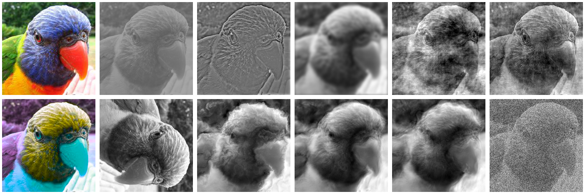

# modelvshuman: Does your model generalise better than humans?

``modelvshuman`` is a Python toolbox to benchmark the gap between human and machine vision. Using this library, both PyTorch and TensorFlow models can be evaluated on 17 out-of-distribution datasets with high-quality human comparison data.

## :trophy: Benchmark

The top-10 models are listed here; training dataset size is indicated in brackets. Additionally, standard ResNet-50 is included as the last entry of the table for comparison. Model ranks are calculated across the full range of 52 models that we tested. If your model scores better than some (or even all) of the models here, please open a pull request and we'll be happy to include it here!

### Most human-like behaviour
winner            | model                           | accuracy difference &#8595;  | observed consistency &#8593; | error consistency &#8593;     | mean rank &#8595;      |
:----------------:|  ------------------------------ |-----------------------------:|-----------------------------:|------------------------------:|-----------------------:|
:1st_place_medal: |  [CLIP](https://arxiv.org/abs/2103.00020): ViT-B (400M)             |                     **.023** |                     **.758** |                      **.281** |                   **1.33**|
:2nd_place_medal: |  [SWSL](https://arxiv.org/abs/1905.00546): ResNeXt-101 (940M)       |                         .028 |                         .752 |                          .237 |                          4|
:3rd_place_medal: |  [BiT-M](https://arxiv.org/abs/1912.11370): ResNet-101x1 (14M)      |                         .034 |                         .733 |                          .252 |                       4.33|
:clap:            |  [BiT-M](https://arxiv.org/abs/1912.11370): ResNet-152x2 (14M)      |                         .035 |                         .737 |                          .243 |                          5|
:clap:            |  [ViT-L](https://openreview.net/forum?id=YicbFdNTTy) (1M)           |                         .033 |                         .738 |                          .222 |                       6.66|
:clap:            |  [BiT-M](https://arxiv.org/abs/1912.11370): ResNet-152x4 (14M)      |                         .035 |                         .732 |                          .233 |                       7.66|
:clap:            |  [BiT-M](https://arxiv.org/abs/1912.11370): ResNet-50x3 (14M)       |                         .040 |                         .726 |                          .228 |                       9.33|
:clap:            |  [BiT-M](https://arxiv.org/abs/1912.11370): ResNet-50x1 (14M)       |                         .042 |                         .718 |                          .240 |                       9.66|
:clap:            |  [ViT-L](https://openreview.net/forum?id=YicbFdNTTy) (14M)          |                         .035 |                         .744 |                          .206 |                       9.66|
:clap:            |  [SWSL](https://arxiv.org/abs/1905.00546): ResNet-50 (940M)         |                         .041 |                         .727 |                          .211 |                      11.66|
...               |  standard [ResNet-50](https://arxiv.org/abs/1502.01852) (1M)        |                         .087 |                         .665 |                          .208 |                      28.66|

### Highest out-of-distribution robustness

winner            |  model                         |   OOD accuracy &#8593;    |   rank &#8595;    |
:----------------:|  ------------------------------| -------------------------:|------------------:|
:1st_place_medal: |  [Noisy Student](https://arxiv.org/abs/1911.04252): ENetL2 (300M)   |                  **.829** |              **1**|
:2nd_place_medal: |  [ViT-L](https://openreview.net/forum?id=YicbFdNTTy) (14M)          |                     .733 |                  2|
:3rd_place_medal: |  [CLIP](https://arxiv.org/abs/2103.00020): ViT-B (400M)            |                      .708 |                  3|
:clap:            |  [ViT-L](https://openreview.net/forum?id=YicbFdNTTy) (1M)          |                      .706 |                  4|
:clap:            |  [SWSL](https://arxiv.org/abs/1905.00546): ResNeXt-101 (940M)      |                      .698 |                  5|
:clap:            |  [BiT-M](https://arxiv.org/abs/1912.11370): ResNet-152x2 (14M)     |                      .694 |                  6|
:clap:            |  [BiT-M](https://arxiv.org/abs/1912.11370): ResNet-152x4 (14M)     |                      .688 |                  7|
:clap:            |  [BiT-M](https://arxiv.org/abs/1912.11370): ResNet-101x3 (14M)     |                      .682 |                  8|
:clap:            |  [BiT-M](https://arxiv.org/abs/1912.11370): ResNet-50x3 (14M)      |                      .679 |                  9|
:clap:            |  [SimCLR](https://arxiv.org/abs/2002.05709): ResNet-50x4 (1M)      |                      .677 |                 10|
...               |  standard [ResNet-50](https://arxiv.org/abs/1502.01852) (1M)       |                      .559 |                 31|

## :wrench: Installation

Simply clone the repository to a location of your choice and follow these steps (requires ``python3.8``):


1. Set the repository home path by running the following from the command line:

    ```
    export MODELVSHUMANDIR=/absolute/path/to/this/repository/
    ```

2. Install package (remove the -e option if you don't intend to add your own model or make any other changes)

    ```
    pip install -e .
    ```

## :microscope: User experience

Simply edit ``examples/evaluate.py`` as desired. This will test a list of models on out-of-distribution datasets, generating plots. If you then compile ``latex-report/report.tex``, all the plots will be included in one convenient PDF report.


## :camel: Model zoo

The following models are currently implemented:

- [x] 20+ standard supervised models from the [torchvision model zoo](https://pytorch.org/docs/1.4.0/torchvision/models.html)
- [x] 5 self-supervised contrastive models (InsDis, MoCo, MoCoV2, InfoMin, PIRL) from the [pycontrast repo](https://github.com/HobbitLong/PyContrast/)
- [x] 3 self-supervised contrastive SimCLR model variants (simclr_resnet50x1, simclr_resnet50x2, simclr_resnet50x4) from the [ptrnet repo](https://github.com/sacadena/ptrnets)
- [x] 3 vision transformer variants (vit_small_patch16_224, vit_base_patch16_224 and vit_large_patch16_224) from the [pytorch-image-models repo](https://github.com/rwightman/pytorch-image-models)
- [x] 10 adversarially "robust" models from [robust-models-transfer repo](https://github.com/microsoft/robust-models-transfer) implemented via the [ptrnet repo](https://github.com/sacadena/ptrnets)
- [x] 3 "ShapeNet" ResNet-50 models with different degree of stylized training from the [texture-vs-shape repo](https://github.com/rgeirhos/texture-vs-shape)
- [x] 3 BagNet models from the [BagNet repo](https://github.com/wielandbrendel/bag-of-feature-DNNs)
- [x] 1 semi-supervised ResNet-50 model pre-trained on 940M images from the [semi-supervised-ImageNet1K-models repo](https://github.com/facebookresearch/semi-supervised-ImageNet1K-models)
- [x] 6 Big Transfer models from the [pytorch-image-models repo](https://github.com/rwightman/pytorch-image-models)

If you e.g. add/implement your own model, please make sure to compute the ImageNet accuracy as a sanity check.


##### How to load a model
If you just want to load a model from the model zoo, this is what you can do:

```python
    # loading a PyTorch model from the zoo
    from modelvshuman.models.pytorch.model_zoo import InfoMin
    model = InfoMin("InfoMin")

    # loading a Tensorflow model from the zoo
    from modelvshuman.models.tensorflow.model_zoo import efficientnet_b0
    model = efficientnet_b0("efficientnet_b0")
```

Then, the model can be evaluated via:

```python
    output_numpy = model.forward_batch(images)
    
    # by default, type(output) is numpy.ndarray, which can be converted to a tensor via:
    output_tensor = torch.tensor(output_numpy)
```

##### How to list all available models

All implemented models are registered by the model registry, which can then be used to list all available models of a certain framework with the following method:

```python
    from modelvshuman import models
    
    print(models.list_models("pytorch"))
    print(models.list_models("tensorflow"))
```

##### How to add a new model
Adding a new model is possible for standard PyTorch and TensorFlow models. Depending on the framework (pytorch / tensorflow), open ``modelvshuman/models/<framework>/model_zoo.py``. Here, you can add your own model with a few lines of code - similar to how you would load it usually. If your model has a custom model definition, create a new subdirectory called ``modelvshuman/models/<framework>/my_fancy_model/fancy_model.py`` which you can then import from ``model_zoo.py`` via ``from .my_fancy_model import fancy_model``.


## :file_folder: Datasets
In total, 17 datasets with human comparison data collected under highly controlled laboratory conditions in the [Wichmannlab](http://www.wichmannlab.org) are available.

Twelve datasets correspond to parametric or binary image distortions. Top row: colour/grayscale, contrast, high-pass, low-pass (blurring), phase noise, power equalisation. Bottom row: opponent colour, rotation, Eidolon I, II and III, uniform noise.


The remaining five datasets correspond to the following nonparametric image manipulations: sketch, stylized, edge, silhouette, texture-shape cue conflict.


##### How to load a dataset
Similarly, if you're interested in just loading a dataset, you can do this via:
```python
   from modelvshuman.datasets import sketch      
   dataset = sketch(batch_size=16, num_workers=4)
```

##### How to list all available datasets
```python
    from modelvshuman import datasets
    
    print(list(datasets.list_datasets().keys()))
```

## :credit_card: Credit

Psychophysical data were collected by us in the vision laboratory of the [Wichmannlab](http://www.wichmannlab.org).

While the psychophysical data was collected ourselves, we used existing image dataset sources. 12 datasets were obtained from [Generalisation in humans and deep neural networks](http://papers.nips.cc/paper/7982-generalisation-in-humans-and-deep-neural-networks.pdf). 4 datasets were obtained from [ImageNet-trained CNNs are biased towards texture; increasing shape bias improves accuracy and robustness](https://openreview.net/forum?id=Bygh9j09KX). Additionally, we used 1 dataset from [Learning Robust Global Representations by Penalizing Local Predictive Power](https://arxiv.org/abs/1905.13549) (sketch images from ImageNet-Sketch).

We thank all model authors and repository maintainers for providing the models described above.
